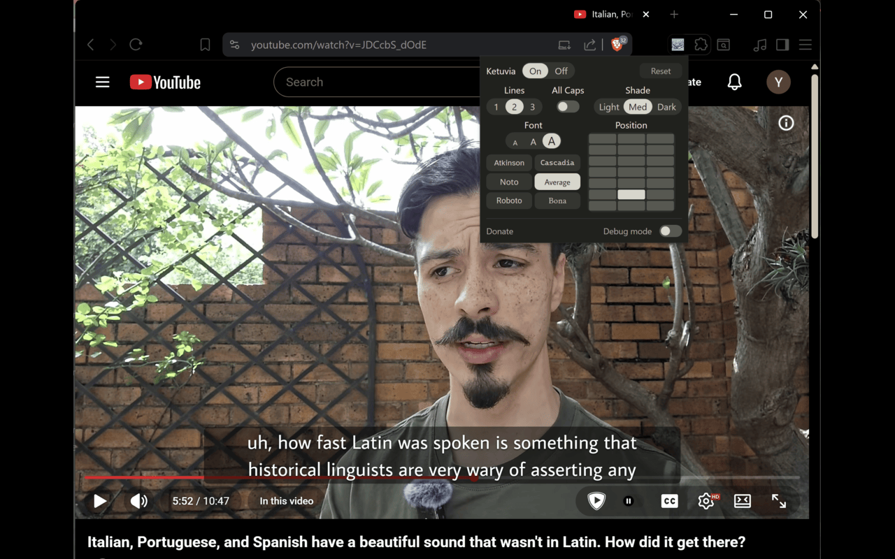

KETUVIA

This extension replaces YouTube's word-by-word auto captions with phrase-level captions that are easier to read. YouTube's auto captions often appear one word at a time as speech is processed, which creates fragmented and hard-to-follow text. This extension fixes that by reading the same caption data, grouping words into natural phrase chunks, and displaying them as continuous sentences instead of incremental word updates. It exists for deaf and hard-of-hearing users, people with sensory processing disorders, language learners, and anyone who finds word-by-word caption rendering difficult to follow.

[Install it from the Chrome Web Store](https://chromewebstore.google.com/detail/ketuvia-accessible-captio/aojjnbkipebndcbnojlliplfbhnpidhk)

Once installed, open a YouTube video with auto captions. A CC+ button will appear in the player controls to turn Ketuvia captions on or off.

Click the Ketuvia extension button in Chrome's toolbar to customize captions. You can change text size, number of caption lines, background shade, font, and caption position. These settings are saved locally.

It runs entirely in the browser and only uses YouTube's existing caption data. It does not collect data, does not send data anywhere, and does not use external services. It works by intercepting YouTube's caption response, extracting word-level timing data, grouping it into readable chunks based on timing and layout rules, and rendering it in a synchronized overlay over the video.

To install manually from this folder, open Chrome or any Chromium-based browser and go to the extensions page (chrome://extensions or equivalent), enable Developer Mode, click "Load unpacked," and select the extension folder.

---

Built by [Yonatan Mateo Aviv](https://www.linkedin.com/in/yonatanaviv) -- software engineer, MS in CS, linguistics enthusiast.
